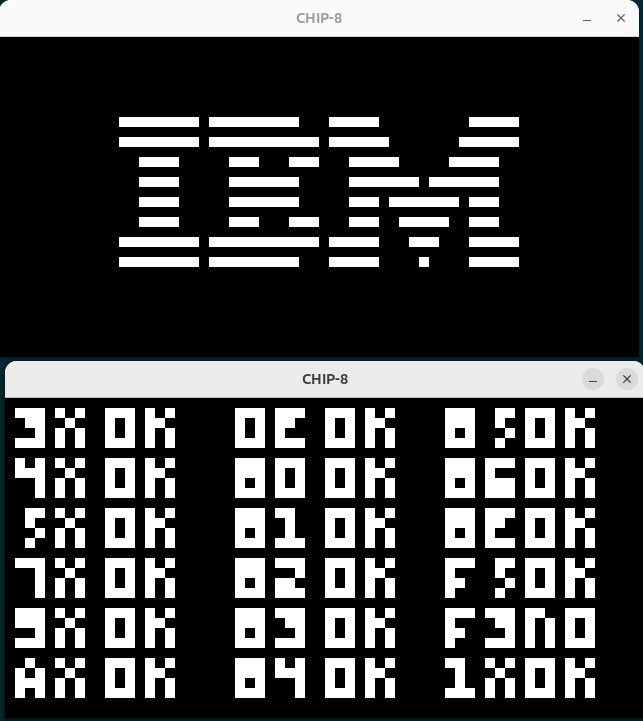

# CHIP8
An emulator for the CHIP-8 interpreter for educational purposes to further
my understanding of C and emulators.

## Requirements
- SDL Library
- C

Compiled on `Ubuntu 24.04` with `gcc version 13.3.0`

## Buildings 
`make all`

`make clean`

## Usage 
`./bin/emulator <filepath to rom>` 

## Documentation & Resources Used:
Indepth article on architecture
- [Guide to making a CHIP-8 Emulator](https://tobiasvl.github.io/blog/write-a-chip-8-emulator/)
- [Cow God's op codes reference list](http://devernay.free.fr/hacks/chip8/C8TECH10.HTM#00E0)

## Todo
- For some reason adding debug statements has the `test_opcode.ch8` test passing but `Bc_test.ch8` isnt.
- Test more with opcodes 
- Fully implement audio, etc.

